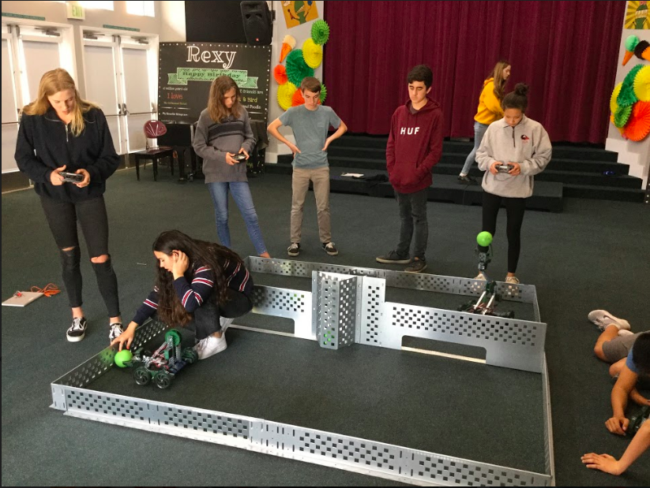

<!DOCTYPE html>
<html>
    
    <head>
        <body style="background-color: rgba(245, 238, 150, 0.47)">
        
            <h1>♡ My First Website ♡</h1>
            <h3> Hi ☺ </h3>
            
            
            
            
 my most visited websites: 

            
            <ul> <li> <a target="_blank"
                               href="https://www.ultimate-guitar.com/">ultimate-guitar-tabs.com</a></li> 
            <li> <a target="_blank" href="https://www.redbubble.com/?gclid=EAIaIQobChMInqS0zMGj4gIVUQwrCh1QMwUkEAAYASAAEgL4GfD_BwE">redbubble.com</a></li> </ul>
            
            
 Here are my top three highlights from DC!:

            <ol> 
            <li> World War II Memorial</li>
            <li> Vietnam Veterans Memorial</li>
            <li> Frederick Douglas's House</li>
          </ol>
           
            <h1> WhiteBox Learning Project:</h1>
            
            
 For our WhiteBox Learning Project, we learned how to simulate and create a prosthetic arm that threw a ball exactly in the middle of a target. 

            
             <ul> <li> <a target="_blank" href="https://www.whiteboxlearning.com/">whiteboxlearning.com</a></li> </ul>
            
            
            
        
            
            <h1> 3D Modeling and Printing Project:</h1>
            
            
 For this project, we learned how to design objects on SketchUp, a website where you can design objects to 3D print. I created a cover for my thumb that has a guitar pick attached at the end so when I play the guitar, I won't get finger calluses!

            
            <ul> <li> <a target="_blank" href="https://app.sketchup.com/app?hl=en&state=QXV0aEtleSAzMDk0ZTRmYy03ZDgyLTRiZjMtYjlkNy0wZDJmYjcxZGYyMGQ_#">sketchup.com</a></li> </ul>
            
            
            
            
            <h1> VEX Project:</h1>
            
            
 In the VEX Robotics project, we first learned to build the vex robots in groups of 5-6 people. Then, we moved on to programming. We used our everday computers to program the robots to be controlled by joysticks. Once we finished programming, we had a contest that tested which group had the best programming, who controlled the robot best, and which robot was the winner. 

           
            
            
            
 I thank everyone for making my Rhoades School experience the best it possibly could me!! 

            
 Much love,  Kylie

            
            
        </body>
    </head>
